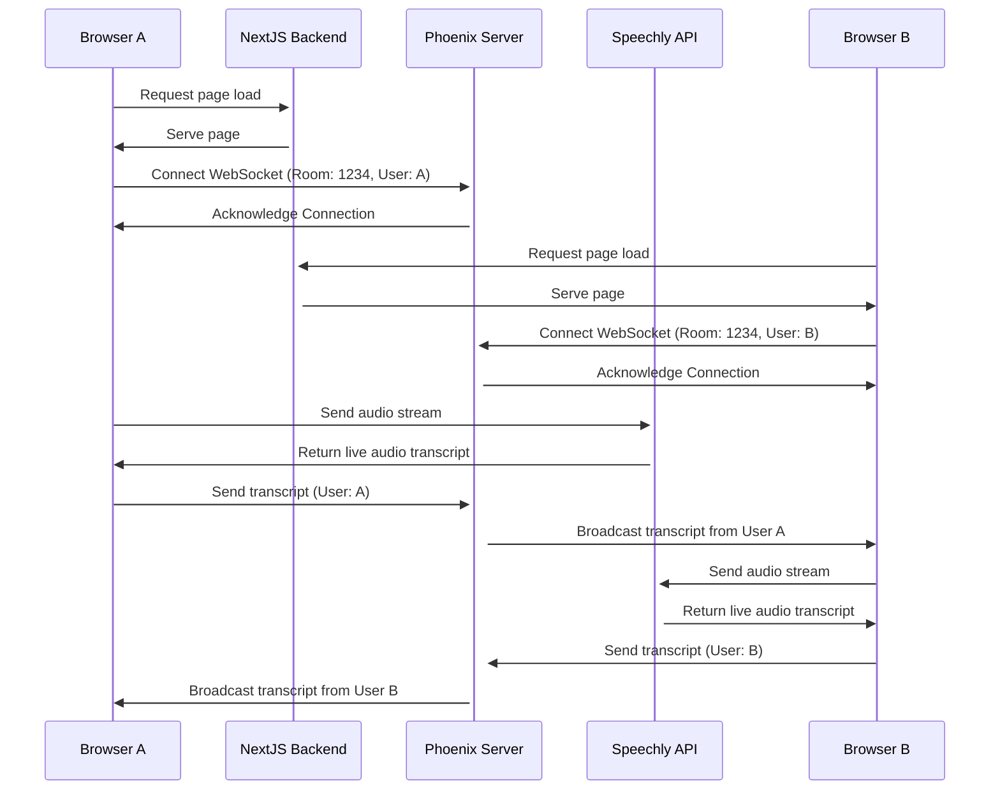

Absolutely! Here's a `README.md` for your sandbox project:

---

# Video Call Live Closed Captioning Sandbox

This project demonstrates a live closed captioning system for video calls using NextJS for the frontend, Speechly for audio transcription, and Phoenix with PubSub for backend real-time interactions.

## System Flow

Here's a visual representation of the system flow using a Mermaid diagram:



### Workflow Explanation:

1. **Page Load**: Each user (Browser A & Browser B in this example) initially loads the application via the NextJS Backend.
2. **WebSocket Connection**: Once loaded, each browser establishes a WebSocket connection with the Phoenix Server to be part of a room, identified by a room ID.
3. **Audio to Transcript**: For closed captioning, each user sends their audio stream to Speechly API, which returns a live audio transcript.
4. **Transcript Broadcasting**: The returned transcript is then sent to the Phoenix Server, which broadcasts it to all connected users in the room.

## Prerequisites

### Using `asdf` for Version Management

This project relies on `asdf` for version management. To ensure consistent behavior across different environments, we use the `.tool-versions` file to specify the required versions for NodeJS and Elixir.

1. If you don't have `asdf` installed, follow the [official installation guide](https://asdf-vm.com/#/core-manage-asdf?id=install).
2. Navigate to the project root directory and install the required versions using: `asdf install`
3. After installing the required versions, the respective language or runtime (NodeJS or Elixir) can be used based on the version specified in the `.tool-versions` file.

## Directory Structure

- `nextjs-app/` - Contains the NextJS frontend application.
- `phoenix-app/` - Houses the Phoenix backend application with PubSub for real-time interactions.

## Getting Started

To set up and run the project, follow these instructions:

### NextJS App

```bash
cd nextjs-app
npm install
npm run dev
```

### Phoenix App

First, ensure you have Elixir and Phoenix installed.

```bash
cd phoenix-app
mix deps.get
mix ecto.setup
mix phx.server
```

### Running Both Applications for Development

For a streamlined local development experience, we've provided a script that runs both the Phoenix and NextJS applications simultaneously.
Using the Development Script:

```shell
./start-dev.sh
```

Both the Phoenix and NextJS servers will start, and their logs will display in your terminal. To stop both servers, use CTRL+C in your terminal, which will terminate both processes.

---

This `README.md` provides a clear introduction and guide to the project, offering context and step-by-step instructions for developers. Modify it as needed to fit any additional specifications or requirements.
