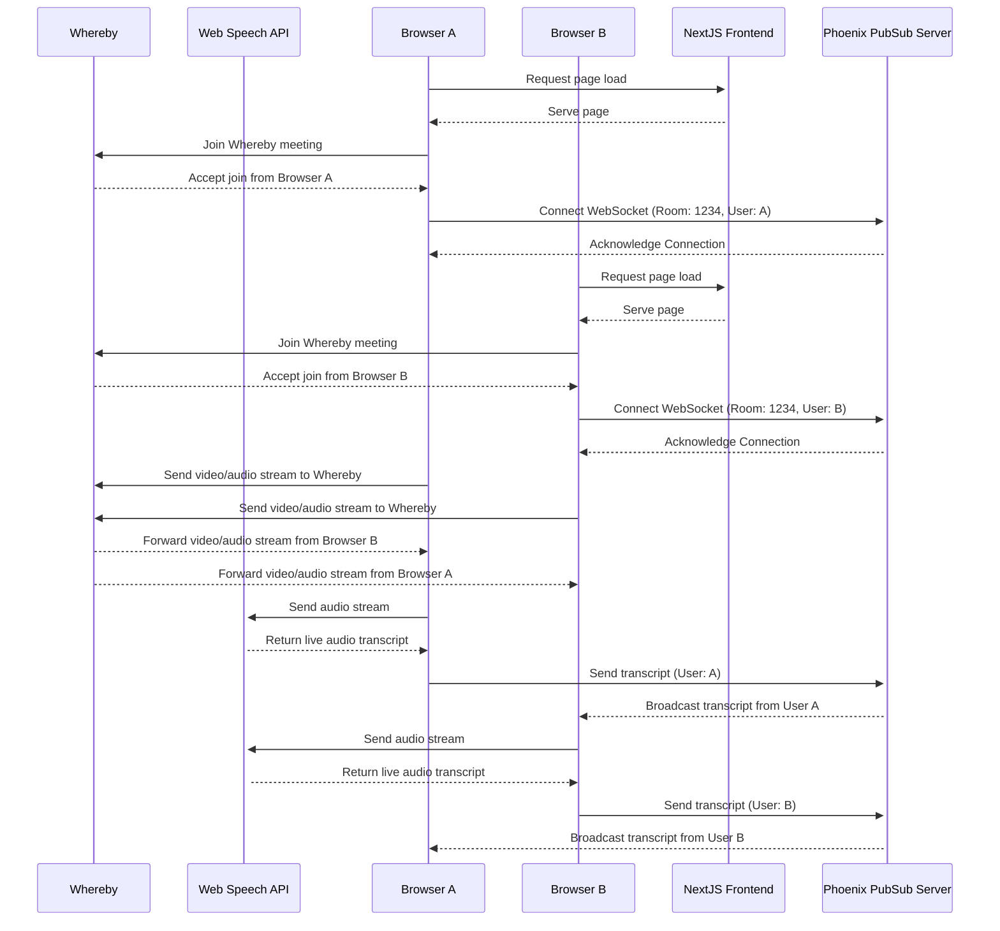
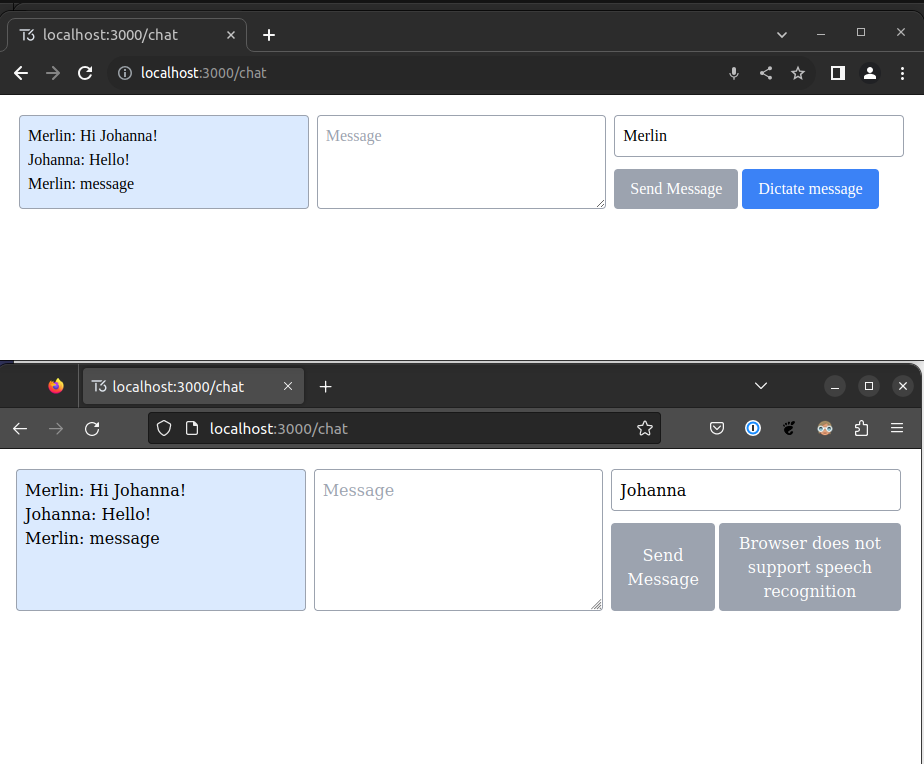

# Video Call Live Closed Captioning Sandbox

This project demonstrates a live closed captioning system for video calls using NextJS for the frontend, WebSpeech for audio transcription, and Phoenix with PubSub for backend real-time interactions. [Whereby](https://whereby.com/) is used as the video conferencing provider.

## System Flow

Here's a visual representation of the system flow of a meeting with transcriptions:



### Workflow Explanation:

1. **Page Load**: Each user (Browser A & Browser B in this example) initially loads the application via the NextJS Backend.
2. **WebSocket Connection**: Once loaded, each browser establishes a WebSocket connection with the Phoenix Server to be part of a room, identified by a room ID.
3. **Audio to Transcript**: For closed captioning, each user sends their audio stream to WebSpeech API, which returns a live audio transcript.
4. **Video call**: A separate connection is made to the Whereby servers to join the meeting, which handles transporting audio and video between the participants.
5. **Transcript Broadcasting**: The returned transcript is then sent to the Phoenix Server, which broadcasts it to all connected users in the room.

## Prerequisites

### Using `asdf` for Version Management

This project relies on `asdf` for version management. To ensure consistent behavior across different environments, we use the `.tool-versions` file to specify the required versions for NodeJS and Elixir.

1. If you don't have `asdf` installed, follow the [official installation guide](https://asdf-vm.com/#/core-manage-asdf?id=install).
2. Navigate to the project root directory and install the required versions using: `asdf install`
3. After installing the required versions, the respective language or runtime (NodeJS or Elixir) can be used based on the version specified in the `.tool-versions` file.

## Directory Structure

- `nextjs-app/` - Contains the NextJS frontend application.
- `phoenix-app/` - Houses the Phoenix backend application with PubSub for real-time interactions.

## Getting Started

To set up and run the project, follow these instructions:

### NextJS App

```bash
cd nextjs-app
npm install
npm run dev
```

### Phoenix App

First, ensure you have Elixir and Phoenix installed.

```bash
cd phoenix-app
mix deps.get
mix ecto.setup
mix phx.server
```

### Running Both Applications for Development

For a streamlined local development experience, we've provided a script that runs both the Phoenix and NextJS applications simultaneously.
Using the Development Script:

```shell
./start-dev.sh
```

Both the Phoenix and NextJS servers will start, and their logs will display in your terminal. To stop both servers, use CTRL+C in your terminal, which will terminate both processes.

## Chat Route (/chat)

### Overview

The Chat route at [/chat](localhost:3000/chat) provides users with an interactive platform to engage in real-time conversations.

### Features

- Live Messaging: Users can exchange messages in real-time.
- Dynamic Username: Before sending messages, each participant can specify their desired username.
- Connection Status: The "Send Message" button is intuitive. It remains inactive until a websocket connection is established and a username is input, ensuring that messages are only sent when conditions are optimal.
- Message dictation: Users can speak to dictate messages. This uses the [Web Speech API](https://developer.mozilla.org/en-US/docs/Web/API/Web_Speech_API).
  - This currently only works on Chrome or Safari based browsers, but polyfills are available to add the missing support in other browsers.
  - [AWS polyfill](https://github.com/ceuk/speech-recognition-aws-polyfill#:~:text=,AWS%20Transcribe%20as%20a%20fallback)
  - [Azure polyfill](https://github.com/compulim/web-speech-cognitive-services)

### What it Looks Like



### How to Access

From the main dashboard or homepage, locate and click on the "Chat" link or button.
Alternatively, you can access it directly by typing in the /chat endpoint in the browser's address bar.

### Technical Details

This app employs Phoenix Channels websocket for real-time bi-directional communication. When the backend broadcasts messages, they are captured and promptly displayed on the frontend for all active participants in the chat room.
